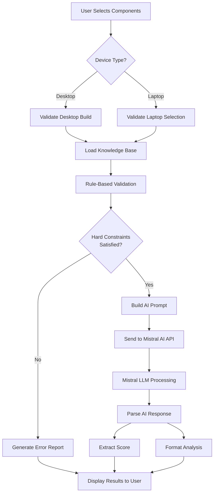

# AI Inference Flow - UIT Hardware Specialist

## Overview

This document explains how AI inference works in the UIT Hardware Specialist system, detailing the integration between rule-based validation and Large Language Model (LLM) analysis.

## Architecture Diagram



## Inference Pipeline

### Phase 1: Client-Side Validation

**Location**: `App.tsx` → `handleAnalyze()`

1. **Component Selection Validation**
   ```typescript
   // Check if mandatory components are selected
   if (deviceType === 'Desktop') {
       if (!build.cpu || !build.motherboard || !build.ram) {
           return error("Missing essential components")
       }
   } else {
       if (!build.laptop) {
           return error("No laptop selected")
       }
   }
   ```

2. **Build Summarization**
   ```typescript
   // Serialize selected components into readable format
   const buildSummary = {
       CPU: `${cpu.name} (${cpu.specs})`,
       GPU: `${gpu.name} (${gpu.specs})`,
       ...
   }
   ```

### Phase 2: Prompt Construction

**Purpose**: Convert structured build data into natural language prompt for LLM

#### Desktop Build Prompt Template

```
Analyze this Desktop PC Build for a UIT Student:

CPU: {cpu.name} ({cpu.specs})
MOTHERBOARD: {motherboard.name} ({motherboard.specs})
GPU: {gpu.name} ({gpu.specs})
RAM: {ram.name} ({ram.specs})
STORAGE: {storage.name} ({storage.specs})
PSU: {psu.name} ({psu.specs})
CASE: {case.name} ({case.specs})

Check for physical compatibility and performance for: 
Visual Studio, Android Studio, Docker, Unity. 

Provide the Suitability Score first.
```

#### Laptop Selection Prompt Template

```
Analyze this Laptop for a UIT Student:

MODEL: {laptop.name}
SPECS: {laptop.specs}
BATTERY: {laptop.battery}

Check for performance, battery life suitability, and portability for:
Visual Studio, Android Studio, Docker, Unity.

Provide the Suitability Score first.
```

#### System Instruction (Role Definition)

The AI is given a persona and task context:

```
ROLE:
You are the "UIT Hardware Specialist," an expert system for the 
University of Information Technology. Your goal is to validate PC 
builds and Laptop choices for Students who need to run demanding software.

CONTEXT - UIT STUDENT WORKLOADS:
1. Software Engineering: Visual Studio, IntelliJ, VS Code
2. Mobile Dev: Android Studio (Heavy RAM & CPU for emulators)
3. Game/Multimedia: Unity, Unreal Engine, Blender (GPU intensive)
4. DevOps/Networking: Docker, Kubernetes, VMs (High RAM/Cores)
5. Data Science: Python, Jupyter, Local LLMs (VRAM & CUDA)

INSTRUCTIONS:
Analyze the provided configuration:
1. Compatibility Check (Desktops): Sockets, RAM type, PSU Wattage, Dimensions
2. Performance Analysis: Can it handle the workloads above?
3. Bottleneck Detection: Are components balanced?
4. Laptop Analysis: Thermal throttling and battery life for campus use

RESPONSE FORMAT (Markdown):
Start with: "SCORE: [0-100]"

Then provide:
✅ COMPATIBLE / ❌ INCOMPATIBLE / ⚠️ ISSUES
Summary: [1-2 sentences]

Workload Suitability:
*   💻 Coding & Compiling: [Rating/Comment]
*   📱 Mobile Emulation: [Rating/Comment]
*   🎨 Graphics & AI: [Rating/Comment]

Expert Verdict: Detailed advice
```

### Phase 3: Backend API Call

**Location**: `services/mistralService.ts` → `sendMessageToMistral()`

```typescript
export const sendMessageToMistral = async (message: string): Promise<string> => {
    // Send to backend proxy
    const response = await fetch(`${API_BASE_URL}/api/chat`, {
        method: 'POST',
        headers: { 'Content-Type': 'application/json' },
        body: JSON.stringify({
            message: message,
            systemInstruction: SYSTEM_INSTRUCTION
        }),
    });
    
    const data = await response.json();
    return data.response;
}
```

**Why Backend Proxy?**
- API key security (not exposed to browser)
- CORS handling
- Rate limiting and error handling
- Centralized logging

### Phase 4: Server-Side Inference

**Location**: `server.js` → `/api/chat` endpoint

```javascript
app.post('/api/chat', async (req, res) => {
    const { message, systemInstruction } = req.body;
    
    // Call Mistral AI API
    const chatResponse = await mistralClient.chat.complete({
        model: 'mistral-large-latest',
        messages: [
            { role: 'system', content: systemInstruction },
            { role: 'user', content: message }
        ],
    });
    
    return res.json({ 
        response: chatResponse.choices[0].message.content 
    });
});
```

**Mistral AI Model**: `mistral-large-latest`
- Large context window (good for detailed specs)
- Strong reasoning capabilities
- Markdown formatting support

### Phase 5: Response Processing

**Location**: `App.tsx` → `handleAnalyze()` callback

1. **Score Extraction**
   ```typescript
   const scoreMatch = responseText.match(/SCORE:\s*(\d+)/i);
   if (scoreMatch) {
       setScore(parseInt(scoreMatch[1], 10));
   }
   ```

2. **Markdown Rendering**
   - Response is passed to `ChatMessage` component
   - Rendered as formatted markdown with syntax highlighting
   - Displays compatibility status, workload ratings, and recommendations

## Neural Network Reasoning (LLM Perspective)

While Mistral is a Large Language Model (not a traditional neural network for classification), it performs neural inference through:

### 1. **Attention Mechanism**
- Transformer architecture attends to relevant parts of the prompt
- Component specifications → Compatibility rules
- Workload requirements → Component capabilities

### 2. **Contextual Understanding**
- Learned from vast corpus of technical documentation
- Understands hardware compatibility (socket types, power requirements)
- Knows software requirements (RAM for emulators, VRAM for ML)

### 3. **Chain-of-Thought Reasoning**
The LLM implicitly performs:
```
1. Parse component specifications
2. Check socket compatibility (CPU socket == Motherboard socket?)
3. Check RAM type (DDR4 vs DDR5 support)
4. Estimate power consumption (CPU TDP + GPU TDP + overhead)
5. Compare against PSU wattage
6. Assess workload suitability (cores for Docker, VRAM for Unity, etc.)
7. Detect bottlenecks (Entry CPU + High-end GPU = bottleneck)
8. Generate score based on weighted factors
9. Format response in required markdown structure```

### 4. **Few-Shot Learning**
System instruction acts as a "few-shot" prompt providing:
- Role definition (expert system persona)
- Context (UIT workloads)
- Output format (structured markdown)
- Evaluation criteria (compatibility, performance, balance)

## Hybrid Intelligence: Rules + AI

### Rule-Based (Deterministic)
✅ **Advantages**: Fast, Explainable, Guaranteed correctness
❌ **Limitations**: Rigid, Can't handle nuance

**Handles**:
- Socket type matching
- RAM type compatibility
- Form factor validation
- Power calculation

### AI-Based (Probabilistic)
✅ **Advantages**: Contextual, Natural language, Handles nuance
❌ **Limitations**: Can hallucinate, Non-deterministic

**Handles**:
- Explaining *why* a build is good/bad
- Nuanced recommendations (thermal management, noise, aesthetics)
- Considering multiple tradeoffs
- Educational explanations for students

### synergy

```
User Input
    ↓
[Rule-Based Validation] ← Knowledge Base (JSON)
    ↓
Hard constraints satisfied?
    ↓ YES
[Build AI Prompt] ← System Instruction
    ↓
[Mistral LLM] → Natural Language Analysis
    ↓
[Parse & Display] → User sees results
```

## Knowledge Graph Integration

The knowledge graph (`knowledge-base/ontology/knowledge-graph.json`) informs AI reasoning:

### Example Knowledge Flow

**User Build**: i5-13600K + RTX 4060 Ti + 32GB DDR5

**Knowledge Graph Traversal**:
1. CPU (i5-13600K) →[REQUIRES_SOCKET]→ Motherboard must have LGA1700
2. GPU (RTX 4060 Ti) →[REQUIRES_POWER]→ PSU must provide ≥550W
3. Workload (Android Studio) →[DEMANDS]→ RAM ≥16GB (✓ 32GB sufficient)
4. Workload (Unity) →[DEMANDS]→ GPU with ≥8GB VRAM (✓ RTX 4060 Ti has 8GB)

**AI Receives Context**:
```
The selected configuration has:
- LGA1700 CPU (i5-13600K)
- Requires LGA1700 motherboard
- GPU needs 550W+ PSU
- Suitable for Android Studio (32GB RAM exceeds 16GB minimum)
- Suitable for Unity (8GB VRAM meets requirement)
```

**AI Output**:
```
SCORE: 82

✅ COMPATIBLE

This is a well-balanced mid-range build suitable for UIT students.

Workload Suitability:
💻 Coding & Compiling: Excellent (14 cores handle compilation well)
📱 Mobile Emulation: Excellent (32GB RAM is ideal for Android Studio)
🎨 Graphics & AI: Very Good (RTX 4060 Ti handles Unity, sufficient for Blender)

Expert Verdict: Solid choice for most UIT programs. The 32GB RAM ensures
smooth multitasking with Docker + Android Studio. Consider upgrading to
RTX 4070 if heavy 3D/AI work is expected.
```

## Performance Considerations

### Latency Breakdown

1. **Client-Side Validation**: <10ms
2. **API Request**: ~50-100ms (network)
3. **Mistral Inference**: 2-5 seconds (LLM generation)
4. **Response Parsing**: <10ms

**Total**: ~2-5 seconds (acceptable for analysis task)

### Optimization Strategies

1. **Caching**: Cache common build configurations
2. **Streaming**: Stream AI response tokens as they're generated
3. **Fallback**: Use rule-based scoring if AI fails
4. **Pre-validation**: Block requests if hard constraints fail

## Error Handling

### Backend Unavailable
```typescript
catch (error) {
    if (error.message.includes('Failed to fetch')) {
        return "Cannot connect to server. Please ensure backend is running."
    }
}
```

### AI Error
```typescript
if (!data.response) {
    return "Received empty response from AI. Please try again."
}
```

### Malformed Response
```typescript
const scoreMatch = responseText.match(/SCORE:\s*(\d+)/i);
if (!scoreMatch) {
    setScore(0); // Default if score not found
}
```

## Future Enhancements

1. **Fine-Tuned Model**: Train Mistral on PC building dataset for better accuracy
2. **Retrieval-Augmented Generation (RAG)**: Inject real-time component specs from database
3. **Multi-Agent System**: Separate agents for compatibility, performance, and recommendations
4. **Reinforcement Learning**: Learn from user ratings to improve suggestions
5. **Explainable AI**: Highlight which knowledge graph nodes influenced the decision

## Conclusion

The UIT Hardware Specialist combines:
- **Knowledge Engineering** (structured rules and ontologies)
- **Neural Inference** (LLM contextual reasoning)
- **Expert System Design** (domain-specific validation)

This hybrid approach provides both precision (rule-based) and flexibility (AI-based), creating a robust tool for students to validate their hardware choices.
