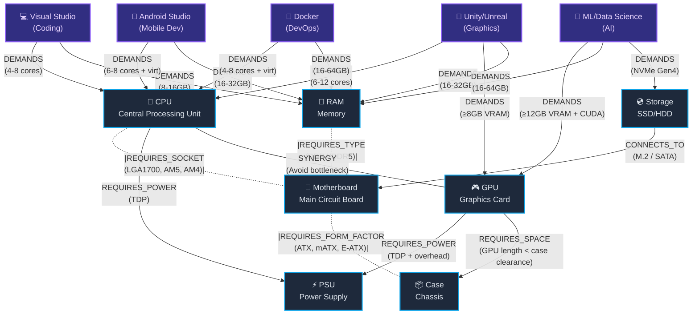
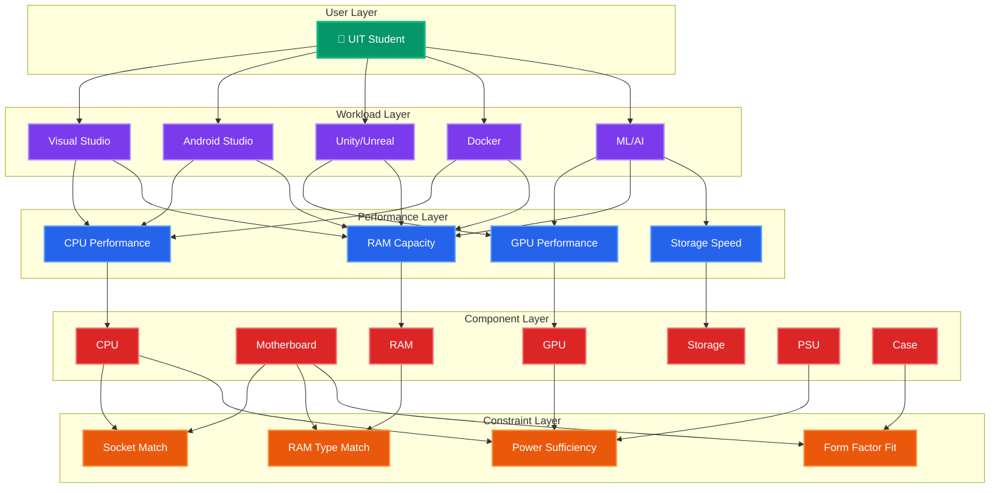
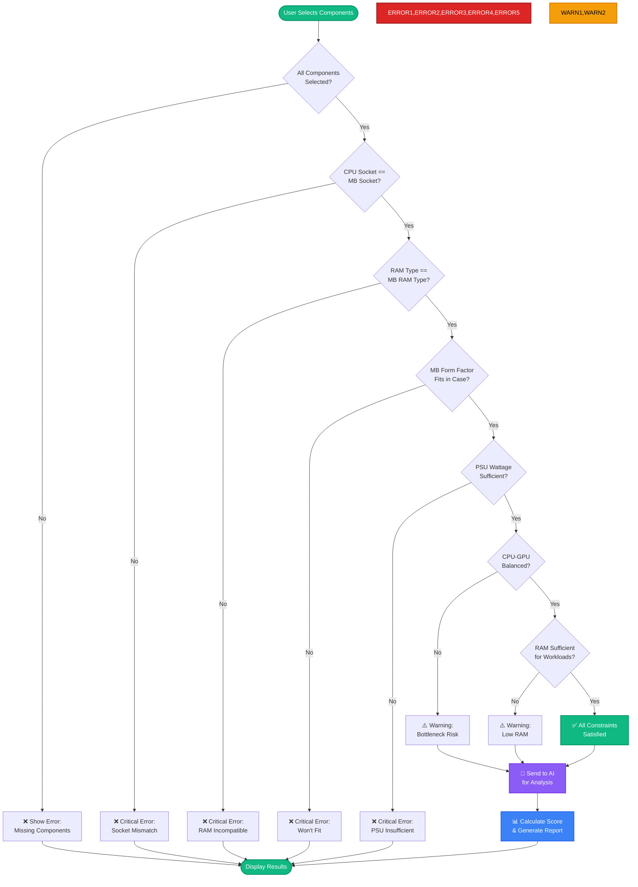
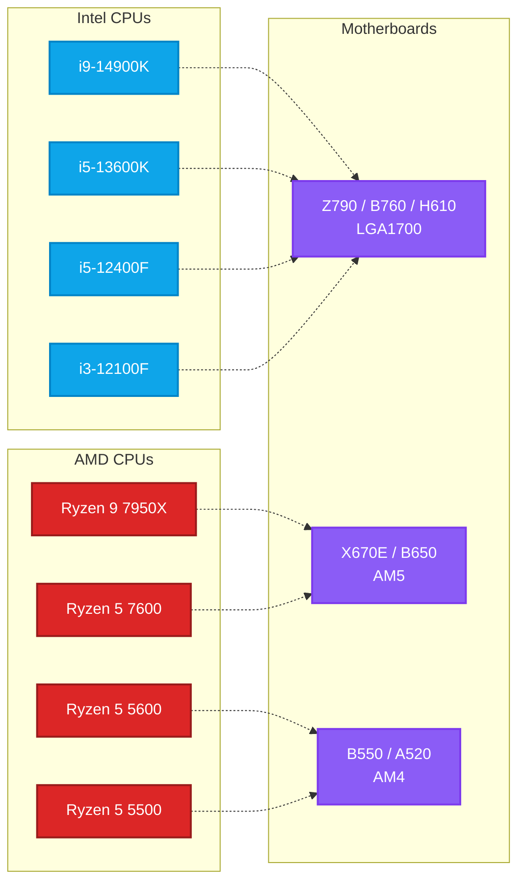
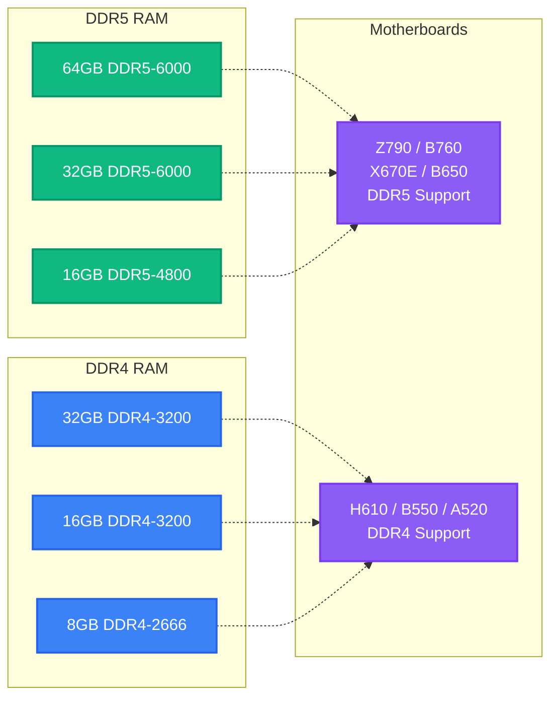
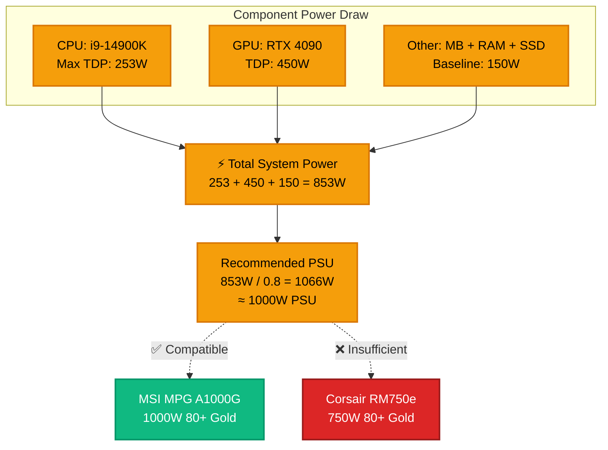

# Knowledge Graph Visualization

This document provides a visual representation of the component relationships and dependencies in the UIT Hardware Specialist expert system.

## Component Relationship Graph

## Relationship Types

### Critical Relationships (Must Satisfy)

#### 1. REQUIRES_SOCKET
**Components**: CPU ↔ Motherboard  
**Constraint**: `cpu.socket == motherboard.socket`  
**Example**: Intel i5-13600K (LGA1700) requires LGA1700 motherboard

#### 2. REQUIRES_TYPE
**Components**: RAM ↔ Motherboard  
**Constraint**: `ram.type == motherboard.ramType`  
**Example**: DDR5 RAM requires DDR5-compatible motherboard

#### 3. REQUIRES_FORM_FACTOR
**Components**: Motherboard ↔ Case  
**Constraint**: `motherboard.formFactor ⊆ case.supportedFormFactors`  
**Example**: ATX motherboard fits in ATX or E-ATX case

#### 4. REQUIRES_POWER
**Components**: CPU/GPU → PSU  
**Constraint**: `(cpu.tdp + gpu.tdp + 150) ≤ psu.wattage * 0.8`  
**Example**: RTX 4090 (450W) + i9-14900K (253W) needs ≥850W PSU

### Soft Relationships (Preferences)

#### 5. SYNERGY
**Components**: CPU ↔ GPU  
**Constraint**: Tiers should be balanced  
**Example**: Entry-level CPU + High-end GPU = bottleneck warning

#### 6. DEMANDS
**Components**: Workload → Components  
**Constraint**: Component specs meet workload requirements  
**Example**: Android Studio demands ≥16GB RAM

## Layered Architecture View

## Inference Rule Flow

## Socket Compatibility Matrix

## RAM Compatibility Matrix

## Power Requirement Example

## Legend

### Node Types
- 🔲 **Essential Component**: Required for desktop builds
- 🎮 **Optional Component**: Recommended but not mandatory
- 💻 **Workload**: Software the user needs to run
- ⚡ **Constraint**: Rule that must be satisfied

### Edge Types
- **Solid Line** (→): Directional dependency
- **Dashed Line** (-.): Bidirectional compatibility requirement
- **Thick Line** (═): Critical relationship

### Severity Levels
- ❌ **Critical**: Build will not work
- ⚠️ **Warning**: Build will work but not optimal
- ✅ **Pass**: No issues detected

## Usage in Expert System

This knowledge graph is used by the system to:

1. **Validate Constraints**: Traverse edges to check compatibility
2. **Detect Bottlenecks**: Compare component tiers via SYNERGY edges
3. **Calculate Scores**: Aggregate workload DEMANDS to determine suitability
4. **Generate AI Context**: Serialize relevant graph paths for LLM prompt

For implementation details, see `knowledge-graph.json` in the ontology directory.
